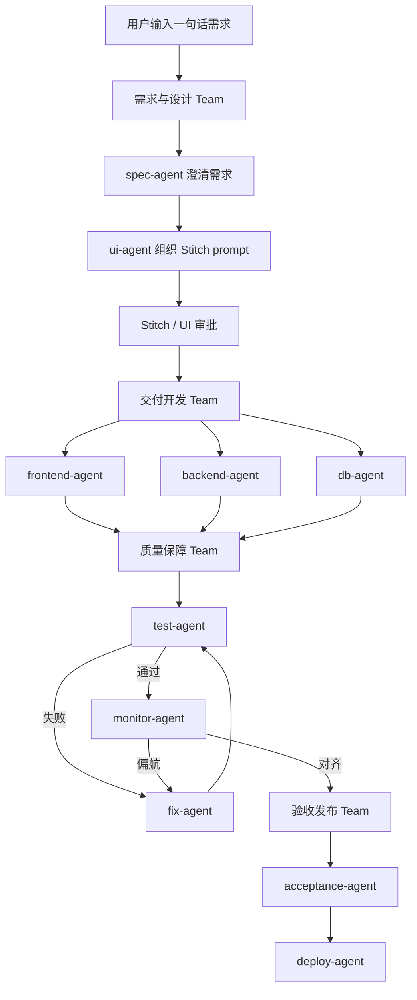

# Agent Teams

这份文档解释：为什么 `UI-SE` 不只是“多个 agent”，而是可以进一步整理成一套真正的 `agent teams` 编排。

## 核心结论

当前仓库里的 skill 和 agent 角色，已经足够作为 `agent teams` 的基础：

- `skill`
  定义每个角色在什么场景触发、怎么思考、怎么交接
- `agent`
  承担某个角色的具体决策
- `orchestrator`
  负责把不同角色组织成 team，并管理阶段流转
- `tool`
  负责 Stitch、文件落盘、数据库执行、测试和部署这些确定性动作

所以真正的 team 不是单个 `SKILL.md`，而是：

`team = orchestrator + 多个 agent + 对应 skill + 工具层 + 共享状态`

## 当前推荐的 Team 划分

### 1. 需求与设计 Team

- `spec-agent`
- `ui-agent`

职责：

- 把一句话需求澄清成结构化 spec
- 生成 Stitch prompt
- 管理 UI 多版本反馈与批准

### 2. 交付开发 Team

- `frontend-agent`
- `backend-agent`
- `db-agent`

职责：

- 把已批准的 spec 和 UI 变成真实代码
- 在 feature 级别分别处理前端、后端、数据库三层

### 3. 质量保障 Team

- `test-agent`
- `fix-agent`
- `monitor-agent`

职责：

- 解释测试结果
- 进入修复闭环
- 检查实现是否偏离需求和 UI

### 4. 验收发布 Team

- `acceptance-agent`
- `deploy-agent`

职责：

- 决定当前版本是否适合给客户看
- 决定是否允许发布到目标环境

## 串并行规则

不是所有角色都适合并行。当前最合理的规则是：

### 必须串行

- `spec-agent -> ui-agent`
- `acceptance-agent -> deploy-agent`

原因：

- UI prompt 必须建立在澄清后的 spec 上
- 发布判断必须建立在验收结果之上

### 可以并行

- `frontend-agent`
- `backend-agent`
- `db-agent`

原因：

- 这三者围绕同一个 feature 工作，但写入范围天然不同
- 只要 orchestrator 做好文件 ownership，就可以并行推进

### 闭环串并混合

- `test-agent -> fix-agent -> test-agent`
- `monitor-agent -> fix-agent -> monitor-agent`

原因：

- 测试和修复天然是循环
- monitor 不是一次性检查，而是修完后还要再看一遍

## 推荐时序图

## 当前配置位置

这套 team 配置现在已经放在：

- [src/config/agent-teams.ts](/Users/menghao/Documents/幻谱/官网演示项目/UI-SE/src/config/agent-teams.ts)

里面包含：

- team 名称
- team 目标
- 串行 / 并行 / 混合执行模式
- 每个成员的职责
- 输入输出约束
- 上下游 team 交接关系

## 当前已经接入的部分

当前 orchestrator 已经开始消费这份配置，用于：

- 判断当前阶段属于哪支 team
- 在不同 team 之间记录 handoff
- 给 agent run、workflow log、dashboard、CLI 输出附带 team 上下文

也就是说，现在已经不是“只有文档和配置”，而是：

- 运行任务时会看到当前 team
- dashboard 会显示 team handoff 时间线
- agent 执行记录会带上 team 信息

## 这份配置后面还能怎么用

接下来最自然的继续落法是：

1. `orchestrator` 根据当前 stage 选中某个 team
2. 读取 `agent-teams.ts` 判断这支 team 的执行模式
3. 串行或并行调度 team 成员
4. 汇总共享产物和结构化结果
5. 决定是否进入下一个 team，或回到修复闭环

## 当前边界

要特别注意：

- skill 已经足够表达“角色怎么做”
- 但 skill 本身不会自动形成 team
- 真正让 team 协作起来的，仍然是运行时代码

所以现在这一步是：

**你已经有一套可运行的 team 分组与交接骨架。**

下一步如果继续往前推，重点就不再是“有没有 team”，而是：

- 是否按 `executionMode` 做真正并行
- 是否把 team 配置进一步下沉到更细的任务分发逻辑
