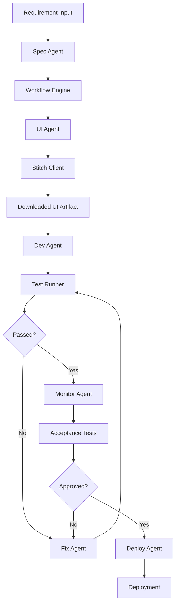

# Architecture

## Goal

Build a delivery system that can move an approved requirement through the following lifecycle:

1. draft and confirm a spec
2. generate a UI draft through Stitch
3. implement one feature at a time
4. test after each feature
5. loop through fixes when tests fail
6. verify the implementation still matches the requirement
7. run acceptance tests and deploy

## Layers

### 1. Workflow layer

The workflow layer owns:

- stage transitions
- retry rules
- failure handling
- progress events
- artifact handoff between steps

This is implemented in code, not in `SKILL.md`.

### 2. Agent layer

Each agent owns a single decision-focused responsibility:

- `spec-agent`: turn raw input into an executable spec
- `ui-agent`: prepare the Stitch submission prompt
- `dev-agent`: define the implementation task for the current feature
- `test-agent`: interpret test results and decide the next step
- `fix-agent`: turn bugs into a repair plan
- `monitor-agent`: check that the build still matches the approved requirement
- `deploy-agent`: approve and prepare deployment

Each agent is configured with:

- a model profile
- a prompt contract
- explicit read scopes
- explicit write scopes
- an allowed tool list

The current scaffold stores those constraints in code so the orchestrator can enforce them consistently when you later plug in a real model runtime.

### 3. Tool layer

The tool layer owns deterministic actions:

- Stitch SDK calls and, when necessary, website automation
- file upload and download
- test execution
- deployment
- storage

The Stitch tool path now also owns explicit proxy handling because the runtime environment may need a manually configured Node fetch dispatcher even when the desktop has a working system proxy.

## Why skills exist in this design

Skills are not the workflow itself. They are reusable operating guides for each agent role.

Use `SKILL.md` to define:

- when the agent should be used
- what inputs it needs
- what outputs it must return
- which tools it should prefer
- what constraints it must respect

The skill explains how the role should think. The orchestrator and tool layer enforce what the role can actually touch at runtime.

## Runtime shape

## Initial delivery plan

### Phase 1

Make one feature flow run end to end with mocks:

- in-memory jobs
- mock Stitch integration
- mock tests
- mock deploy

### Phase 2

Replace mocks with real deterministic integrations:

- Stitch SDK first, Playwright only for uncovered flows
- real repo tasks for development
- real unit and end-to-end tests
- staging deployment

### Phase 3

Upgrade the decision nodes:

- model-backed planning
- better repair loops
- risk scoring
- richer alignment checks
