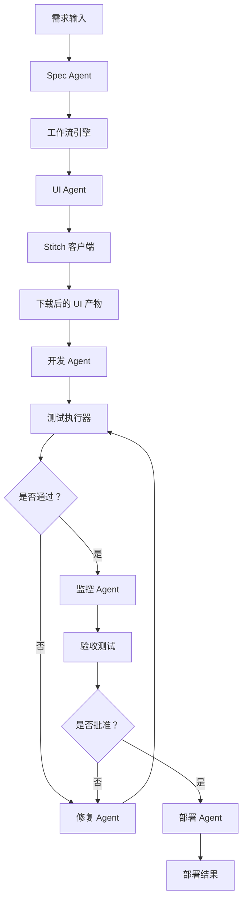

# 架构说明

## 目标

构建一个交付系统，让一份已批准的需求能够沿着下面这条生命周期稳定流转：

1. 起草并确认 spec
2. 通过 Stitch 生成 UI 初稿
3. 按功能点逐个实现
4. 每完成一个功能点就执行测试
5. 测试失败时进入修复循环
6. 验证当前实现是否仍与需求一致
7. 执行验收测试并发布

## 分层

### 1. 工作流层

工作流层负责：

- 阶段流转
- 重试规则
- 失败处理
- 进度事件
- 各步骤之间的产物交接

这一层应当通过代码实现，而不是写在 `SKILL.md` 里。

### 2. Agent 层

每个 agent 只负责一个以“判断”为核心的职责：

- `spec-agent`：把原始输入整理成可执行的 spec
- `ui-agent`：准备提交给 Stitch 的 prompt
- `dev-agent`：为当前功能点定义实现任务
- `test-agent`：解释测试结果并决定下一步动作
- `fix-agent`：把 bug 收敛成修复计划
- `monitor-agent`：检查当前构建是否仍符合已批准需求
- `deploy-agent`：批准并准备部署

每个 agent 都会配置：

- 模型画像
- prompt 契约
- 明确的读权限范围
- 明确的写权限范围
- 允许使用的工具列表

当前这套骨架把这些约束都放在代码里，这样后面接入真实模型运行时，orchestrator 依然可以稳定执行同一套规则。

### 3. 工具层

工具层负责确定性的动作：

- Stitch SDK 调用，以及在必要时补充网站自动化
- 文件上传与下载
- 测试执行
- 部署
- 存储

当前 Stitch 工具链还额外负责显式代理处理，因为运行环境即使桌面系统代理可用，Node 的 `fetch` 运行时也可能仍然需要手动配置 dispatcher。

## 为什么这里还要有 skill

skill 不是工作流本身，而是每个 agent 角色可复用的操作指南。

应当用 `SKILL.md` 来定义：

- 什么时候应该使用这个 agent
- 它需要哪些输入
- 它必须返回哪些输出
- 它应该优先使用哪些工具
- 它必须遵守哪些约束

skill 决定“这个角色应该怎么思考”；而 orchestrator 和工具层决定“这个角色在运行时真正能接触什么”。

## 运行形态

## 初始交付计划

### 第一阶段

先用 mock 打通单个功能点的端到端闭环：

- 内存态 jobs
- mock Stitch 集成
- mock 测试
- mock 部署

### 第二阶段

把 mock 逐步替换成真实、确定性的集成：

- 优先接 Stitch SDK，只有 SDK 覆盖不到的流程再补 Playwright
- 用真实仓库任务承接开发
- 执行真实单元测试和端到端测试
- 发布到 staging 环境

### 第三阶段

继续升级那些“需要判断”的节点：

- 用模型驱动更强的规划能力
- 做更完整的修复循环
- 增加风险评分
- 增强一致性与偏航检查
